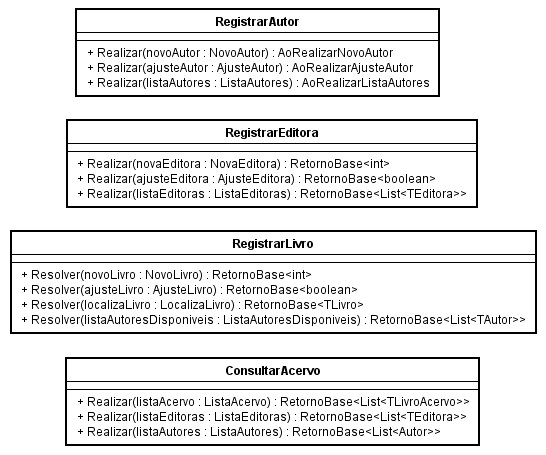

# BiblioPop

**Introdução** 

BiblioPop é uma biblioteca física e popular de livros mantida pela própria população da cidade de Regente Feijó. 
A biblioteca administra um acervo de livros variados e disponíveis à qualquer pessoa que 
se dirige até a instalação física. 
Não é necessário ter cadastro para ler os livros, basta apresentar um documento como RG ou CPF e deixá-lo na mesa do assistente. 
Qualquer pessoa pode contribuir com o projeto e levar livros até a biblioteca. 
Quem administra o acervo é o próprio assitente, que deve registrar os livros e guardar na estante devida. 
Para ler um ou vários livros o leitor pode procurar por conta própria, mas pode também procurar o assistente que deve então informar com precisão em qual estante os livros desejados se encontram.

**BiblioPopApp** 

BiblioPopApp é o sistema de administração que se aplica à BiblioPop. 
Trata-se de um sistema simples que auxilia o assistente em suas tarefas. 

---

>### **Versão 1**

**Requisitos Funcionais do Sistema** 

- O sistema deve permitir o registro de novos livros.
- O sistema deve permitir o ajuste de características de um livro já registrado, inclusive a posição física do livro na biblioteca (estante).
- O sistema deve permitir a consulta de livros já registrados para obter informações sobre o livro, como por exemplo a localização (estante). A consulta pode ser feita por nome de autor e/ou por título do livro.
- O sistema não vai ser acessado pelos leitores. Apenas o assistente vai acessar o sistema. 

**Requisitos Não Funcionais**

- O sistema não precisa funcionar em rede e nem precisa estar disponível na internet. Portanto pode ser instalado localmente num computador pessoal ou notebook com sistema operacional Windows. 

**Análise** 

- **Diagrama de Casos de Uso** 

- **Diagrama de Classes do Domínio** 

- **Classes da Aplicação** 

